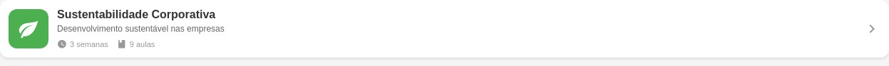
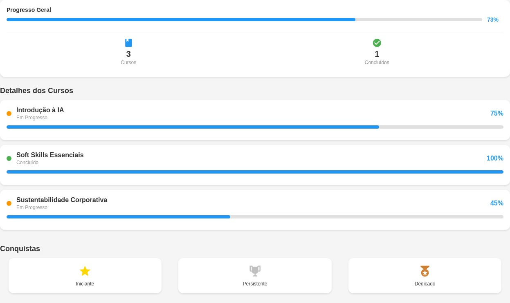
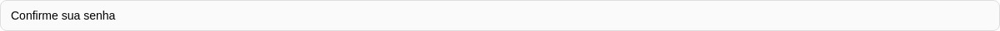

# Documentação do Aplicativo SkillUpPlus 2030+

## 1. Introdução

O **SkillUpPlus 2030+** é um aplicativo móvel desenvolvido em **React Native** (utilizando Expo Router) com o objetivo de apoiar trabalhadores e estudantes na requalificação profissional (reskilling) frente às transformações do mercado de trabalho, alinhado aos Objetivos de Desenvolvimento Sustentável (ODS) da ONU (ODS 4, 8, 9 e 10).

O projeto atende aos requisitos da Global Solution (GS) da disciplina Mobile Development & IoT, implementando uma estrutura de navegação híbrida e utilizando diversos componentes nativos.

## 2. Estrutura de Diretórios da Aplicação

A estrutura de diretórios segue o padrão do Expo Router, que utiliza o sistema de arquivos para roteamento, facilitando a organização e a navegação.

\`\`\`
./
├── app/
│   ├── (drawer)/
│   │   ├── (tabs)/
│   │   │   ├── _layout.tsx (Configuração do Tab Navigation)
│   │   │   ├── courses.tsx (Tela de Cursos com Busca e Filtro - Picker)
│   │   │   ├── index.tsx (Tela Home com Progresso e Recomendações)
│   │   │   └── progress.tsx (Tela de Progresso com Barras e Expansão)
│   │   ├── _layout.tsx (Configuração do Drawer Navigation)
│   │   ├── profile.tsx (Tela de Perfil com Edição e Estatísticas)
│   │   └── settings.tsx (Tela de Configurações com Switches e Opções)
│   ├── _layout.tsx (Configuração do Stack Navigation Principal)
│   ├── login.tsx (Tela de Login com Validação e Hooks)
│   └── signup.tsx (Tela de Cadastro com Validação e Picker)
├── assets/
│   └── images/
│       └── icon.svg (Ícone do App)
├── package.json
├── screenshots/ (Prints das telas)
└── tsconfig.json
\`\`\`

## 3. Fluxo de Navegação Híbrida e Justificativas de Design

O aplicativo utiliza uma **Navegação Híbrida** (Stack, Drawer e Tab) para oferecer uma experiência de usuário fluida e intuitiva, conforme exigido.

| Tipo de Navegação | Uso no App | Justificativa de Design |
| :--- | :--- | :--- |
| **Stack Navigation** | Telas de Login (`login.tsx`), Cadastro (`signup.tsx`) e o fluxo principal (`(drawer)`). | Usado para fluxo sequencial e hierárquico. O login/cadastro é uma pilha separada do conteúdo principal, garantindo que o usuário não possa voltar para o conteúdo sem autenticação. |
| **Drawer Navigation** | Menu lateral para acesso a seções principais: Home, Meu Perfil e Configurações. | Ideal para seções que não são o foco principal do aplicativo, mas que precisam de acesso rápido a partir de qualquer tela. O Drawer envolve o Tab Navigation. |
| **Tab Navigation** | Abas inferiores para alternar entre as funcionalidades centrais: Home, Cursos e Progresso. | Perfeito para alternar rapidamente entre funcionalidades relacionadas e mais utilizadas, mantendo a navegação principal sempre visível e acessível. |

**Fluxo Principal:**

1.  **Acesso Inicial:** O usuário é direcionado para a tela de **Login** (`login.tsx`).
2.  **Autenticação:** Após o login (ou cadastro em `signup.tsx`), o usuário é redirecionado para a tela principal, que é o **Drawer Navigation**.
3.  **Conteúdo Central:** Dentro do Drawer, o usuário acessa o **Tab Navigation** (Home, Cursos, Progresso) para as funcionalidades diárias.
4.  **Acessos Secundários:** O **Drawer** permite acessar o **Perfil** e as **Configurações**, que são telas de nível superior fora do fluxo de abas.

## 4. Implementação de Componentes e Hooks

Todos os componentes obrigatórios foram utilizados, com destaque para:

*   **Formulários Validados e Hooks:** As telas `login.tsx` e `signup.tsx` utilizam o `useState` para gerenciar o estado dos campos (`TextInput`) e implementam validações básicas (campos vazios, formato de email, confirmação de senha) antes de simular o login/cadastro. O `useRouter` (Hook do Expo Router) é usado para a navegação.
*   **Componentes de Interação:** `TouchableOpacity` é usado em botões e cards de curso para criar áreas clicáveis com feedback visual. `Alert` é usado para mensagens de erro e sucesso.
*   **Componente `Picker`:** Utilizado na tela de `signup.tsx` para a seleção da "Área de Interesse", e na tela `courses.tsx` para o filtro de cursos por categoria.
*   **Persistência de Dados (Bônus):** O `AsyncStorage` é utilizado nas telas de login/cadastro para simular a persistência do `userName` e `userEmail`, permitindo que a tela Home exiba o nome do usuário e que a tela de Perfil carregue as informações.

## 5. Prints das Telas (Emulador Android)

As imagens a seguir foram capturadas do aplicativo em execução no ambiente de desenvolvimento (simulando um dispositivo Android).

| Tela | Imagem |
| :--- | :--- |
| **01 - Home (Tab)** |  |
| **02 - Cursos (Tab)** |  |
| **03 - Progresso (Tab)** |  |
| **04 - Menu Drawer** |  |
| **05 - Perfil (Drawer)** |  |
| **06 - Configurações (Drawer)** |  |
| **07 - Login (Stack)** |  |
| **08 - Cadastro (Stack)** |  |

## 6. Códigos-Fonte Principais

O código-fonte completo está disponível no diretório do projeto. Abaixo estão os trechos dos arquivos principais que demonstram a implementação dos requisitos.

### **A. Configuração da Navegação Híbrida (`app/(drawer)/(tabs)/_layout.tsx`)**

Este arquivo configura o **Tab Navigation** (abas inferiores) que fica aninhado dentro do Drawer.

\`\`\`tsx
import { Tabs } from 'expo-router';
import React from 'react';
import { MaterialCommunityIcons } from '@expo/vector-icons';

export default function TabLayout() {
  return (
    <Tabs
      screenOptions={{
        tabBarActiveTintColor: '#2196F3',
        tabBarInactiveTintColor: '#999',
        headerShown: false,
      }}>
      <Tabs.Screen
        name="index"
        options={{
          title: 'Home',
          tabBarIcon: ({ color }) => (
            <MaterialCommunityIcons name="home" size={24} color={color} />
          ),
        }}
      />
      {/* ... outras abas (courses, progress) */}
    </Tabs>
  );
}
\`\`\`

### **B. Formulário de Cadastro com Validação e Picker (`app/signup.tsx`)**

Demonstra o uso de `useState` e `Alert` para validação, além do componente `Picker` para seleção de área de interesse.

\`\`\`tsx
// ... imports
import { Picker } from 'react-native';
import AsyncStorage from '@react-native-async-storage/async-storage';

export default function SignupScreen() {
  const [name, setName] = useState('');
  const [email, setEmail] = useState('');
  const [password, setPassword] = useState('');
  const [confirmPassword, setConfirmPassword] = useState('');
  const [interests, setInterests] = useState('');
  // ...

  const handleSignup = async () => {
    if (!name || !email || !password || !confirmPassword || !interests) {
      Alert.alert('Erro', 'Por favor, preencha todos os campos');
      return;
    }
    // ... validações de email e senha

    // Simular cadastro e persistir dados (Bônus)
    await AsyncStorage.setItem('userEmail', email);
    await AsyncStorage.setItem('userName', name);
    await AsyncStorage.setItem('userInterests', interests);
    await AsyncStorage.setItem('isLoggedIn', 'true');
    
    Alert.alert('Sucesso', 'Conta criada com sucesso!');
    // ... navegação
  };

  return (
    // ...
    <View style={styles.pickerContainer}>
      <Picker
        selectedValue={interests}
        onValueChange={setInterests}
        style={styles.picker}>
        <Picker.Item label="Selecione uma área" value="" />
        <Picker.Item label="Inteligência Artificial" value="ia" />
        {/* ... outras opções */}
      </Picker>
    </View>
    // ...
  );
}
\`\`\`

### **C. Tela de Progresso com `ScrollView` e Componentes Visuais (`app/(drawer)/(tabs)/progress.tsx`)**

A tela utiliza `ScrollView` para permitir a visualização de conteúdo longo e componentes visuais para exibir o progresso (`ProgressBar` customizado).

\`\`\`tsx
// ... imports

const ProgressBar = ({ progress }) => {
  return (
    <View style={styles.progressBarContainer}>
      <View
        style={[
          styles.progressBarFill,
          { width: \`${progress}%\` },
        ]}
      />
    </View>
  );
};

export default function ProgressScreen() {
  // ... lógica de estado e dados

  return (
    <View style={styles.container}>
      {/* ... Header */}
      <ScrollView style={styles.content} showsVerticalScrollIndicator={false}>
        {/* ... Resumo e Estatísticas */}
        
        <Text style={styles.sectionTitle}>Detalhes dos Cursos</Text>

        {PROGRESS_DATA.map((item) => renderProgressCard(item))}
        
        {/* ... Conquistas */}
      </ScrollView>
    </View>
  );
}
// ... estilos
\`\`\`

## 7. Conclusão

O projeto **SkillUpPlus 2030+** foi desenvolvido seguindo rigorosamente os requisitos da Global Solution, entregando um aplicativo funcional com navegação híbrida, formulários validados, uso de Hooks e persistência de dados (bônus), além da documentação completa com prints do emulador e estrutura de código.
